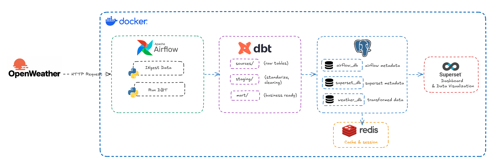
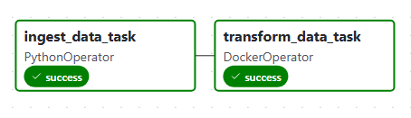
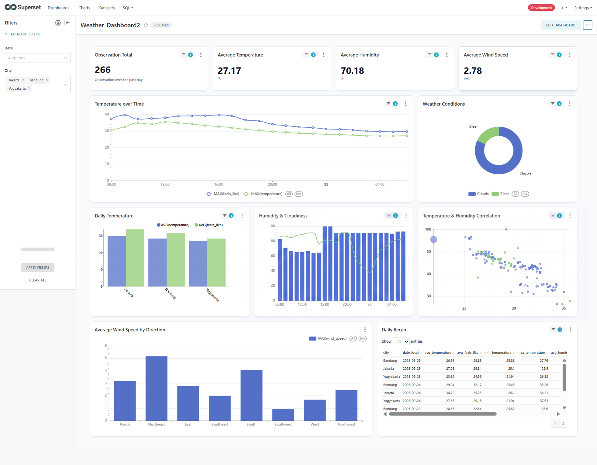

# Weather Data Engineering Pipeline

An end-to-end **Data Engineering** project that automates the extraction, loading, transformation, orchestration, and visualization of real-time weather data.

The project follows a modern **ELT architecture** using **Apache Airflow**, **PostgreSQL**, **dbt**, **Docker**, and **Apache Superset**.

---

## Project Overview

This project automatically fetches current weather data from the **OpenWeatherMap API** for major Indonesian cities (Jakarta, Bandung, Yogyakarta) on an hourly schedule, ingests the raw data into PostgreSQL, transforms it into analytics-ready models using dbt, orchestrates the entire workflow with Apache Airflow, and exposes the final reporting layer for business intelligence through Apache Superset.

---

## Architecture



---

## Tech Stack

| Category | Technology |
|----------|------------|
| Language | Python |
| Database | PostgreSQL 14 |
| Data Transformation | dbt 1.9 |
| Orchestration | Apache Airflow 3.0 |
| Visualization | Apache Superset 3.0 |
| Containerization | Docker & Docker Compose |
| Data Source | OpenWeatherMap REST API |

---

## ELT Workflow

### 1. Extract

- Connects to the OpenWeatherMap API
- Fetches current weather data for Jakarta, Bandung, and Yogyakarta
- Retrieves temperature, humidity, pressure, wind speed, clouds, and weather description

---

### 2. Load

- Converts temperature from Kelvin to Celsius
- Standardizes and structures the API response
- Loads raw data into the **Raw** PostgreSQL schema (`dev.raw_weather_data`)

---

### 3. Transform (dbt)

The warehouse follows a layered architecture.

| Layer | Model | Description |
|-------|-------|-------------|
| Staging | `stg_weather_data` | Deduplicates records using `row_number()`, converts timestamps to `Asia/Jakarta` timezone, renames columns for consistency |
| Mart | `daily_average` | Daily aggregated weather metrics per city (avg temperature, humidity, pressure, wind speed, clouds) |
| Mart | `weather_report` | Clean, report-ready dataset optimized for dashboard consumption |

---

## dbt Features

- Sources
- Models
- Materializations
- Modular SQL Transformations
- Lineage Graph
- Documentation

---

## Airflow Pipeline

The workflow is orchestrated using Apache Airflow.

### DAG Structure




The pipeline runs **hourly** and consists of two sequential tasks:

1. **Ingest** — PythonOperator fetches weather data from OpenWeatherMap and inserts into PostgreSQL
2. **Transform** — DockerOperator spins up a dbt-postgres container and runs `dbt run`

---

## Data Warehouse Layers

| Schema | Purpose |
|---------|---------|
| dev | Raw ingested data, staging models, and mart models |

### Model Lineage

```text
raw_weather_data  (source)
        |
        v
  stg_weather_data  (staging)
        |
   +---------+
   |         |
   v         v
daily_average  weather_report
  (mart)        (mart)
```

---

## Apache Superset

Visualization reporting layer is consumed by Apache Superset.




---

## Data Quality

Data quality is enforced through:

- Source validation in dbt sources definition
- Deduplication logic in staging models
- Timestamp normalization across all models

---

## Features

- End-to-End ELT Pipeline
- Fully Dockerized Environment
- Automated Hourly Data Ingestion
- PostgreSQL Data Warehouse
- Layered dbt Architecture (Staging → Mart)
- Airflow Workflow Orchestration
- DockerOperator for dbt Execution
- Interactive Dashboards with Apache Superset
- Modular & Scalable Project Structure

---

For project instructions, see **[Getting Started](docs/getting-started.md)**.
